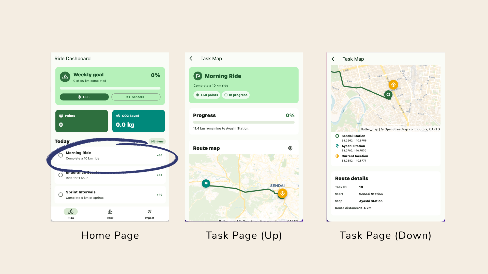

# CyBon — Bike Competition for Carbon Neutrality



A cross-platform cycling challenge app that motivates riders to replace car trips with bike rides through daily tasks, streak tracking, a point-based leaderboard, and real-time GPS/sensor monitoring.

> **Status:** Active development — the codebase is undergoing ongoing refactoring. Several screens still use hardcoded placeholder data while the full backend integration is built out. See [Known Limitations](#known-limitations) below.

## Project Members

- [Iurii](https://github.com/Qumetri)
- [Pai](https://github.com/bamboo51)
- [Komatsu](https://github.com/s2201125-sys/)
- Mahiro
- [Sou](https://github.com/J2523-Sou)

---

## Architecture

```
.
├── backend/          # Python Flask REST API (Gunicorn + PostgreSQL)
├── lib/              # Flutter application source (Dart)
│   ├── models/       # Data models
│   ├── navigation/   # Bottom-nav shell
│   ├── pages/        # Screens: Home, Leaderboard, Account
│   ├── services/     # Auth, sensor, and API service layer
│   └── widgets/      # Reusable UI components
├── migrations/       # Root-level Alembic stubs (see backend/migrations for active ones)
├── android/ ios/ web/ linux/ macos/ windows/   # Flutter platform targets
└── docker-compose.yml
```

| Layer | Technology |
|---|---|
| Mobile / cross-platform UI | Flutter 3 · Dart 3.11 |
| REST API | Python 3 · Flask 3 · Gunicorn |
| Database | PostgreSQL 15 · SQLAlchemy 2 · Alembic |
| Authentication | Google OAuth2 (ID-token) · Flask-JWT-Extended |
| Maps & routing | flutter_map (OpenStreetMap/CARTO) · OSRM |
| Sensors | geolocator · sensors_plus |
| Container | Docker Compose |

---

## Features

### Flutter App

| Screen | Description |
|---|---|
| **Ride Dashboard** | Weekly distance goal with progress bar, live GPS one-shot test, live sensor sheet (GPS · accelerometer · gyroscope), today's tasks and bonus tasks |
| **Task Map** | Per-task map page showing the route from Sendai Station to Ayashi Station (via OSRM), real-time rider position projected on the polyline, progress percentage |
| **Leaderboard** | Podium + full ranked list switchable between Workers and Departments; shows points, distance (km), and CO2 saved (kg) |
| **Account** | Google Sign-In / Sign-Out, user profile header, placeholder stat cards (pending `/users/me` endpoint) |

### Backend API

All endpoints are documented in [`backend/openapi.yaml`](backend/openapi.yaml).

| Group | Endpoints |
|---|---|
| **Health** | `GET /health` |
| **Auth** | `POST /auth/google` · `GET /auth/dev-token/{user_id}` (dev only) |
| **Riders** | `GET /riders/` · `GET /riders/{id}` · `POST /riders/` |
| **Races** | `GET /races/` · `GET /races/{id}` · `POST /races/` |
| **Tasks** | `GET /tasks/today` · `PATCH /tasks/{id}/progress` |
| **Leaderboard** | `GET /leaderboard/?metric={points\|distance\|time\|streak}&limit=N` |

Protected endpoints require `Authorization: Bearer <JWT>` obtained from `/auth/google`.

### Database Models

- **User** — Google sub, email, name, points, distance (m), time (s), current/longest streak, last activity date
- **DailyTask / RandomTask** — task templates with type (`distance | time | count`) and target value
- **UserDailyTask** — daily task assigned to a user with progress tracking and auto-completion
- **Team / Rider / Race / Result** — competition data models

---

## Getting Started

### Prerequisites

- Flutter SDK ≥ 3.11
- Docker & Docker Compose
- A Google Cloud project with OAuth2 credentials (Web + Android/iOS client IDs)

### 1. Backend (Docker Compose)

```bash
cp .env.example .env
# Edit .env — set JWT_SECRET_KEY and GOOGLE_CLIENT_ID
docker compose up --build
```

The backend starts on `http://localhost:5000`. Alembic migrations run automatically on startup.

To seed sample data:

```bash
docker compose exec backend python seed.py
```

### 2. Flutter App

```bash
flutter pub get

# Android emulator — backend reachable at 10.0.2.2:5000 by default
flutter run \
  --dart-define=GOOGLE_WEB_CLIENT_ID=<your-web-client-id>.apps.googleusercontent.com

# Physical device or custom host
flutter run \
  --dart-define=GOOGLE_WEB_CLIENT_ID=<your-web-client-id>.apps.googleusercontent.com \
  --dart-define=API_BASE_URL=http://<device-ip>:5000
```

Build-time variables:

| Variable | Default | Description |
|---|---|---|
| `GOOGLE_WEB_CLIENT_ID` | *(required)* | Google OAuth2 web client ID |
| `API_BASE_URL` | `http://10.0.2.2:5000` | Backend base URL |

---

## Project Structure — Key Files

```
backend/
  app/main.py           # Flask app factory
  app/models.py         # SQLAlchemy ORM models
  app/routes/auth.py    # Google OAuth2 + JWT issuance
  app/routes/tasks.py   # Daily task progress + streak + points logic
  app/routes/leaderboard.py
  migrations/versions/  # Alembic migration scripts
  openapi.yaml          # Full API spec (OpenAPI 3.0)

lib/
  main.dart                         # App entry, theme, MaterialApp
  navigation/main_navigation.dart   # Bottom NavigationBar shell
  pages/home_page.dart              # Ride dashboard + task list + map page
  pages/leaderboard_page.dart       # Leaderboard with podium
  pages/account_page.dart           # Google Sign-In / profile
  services/auth_service.dart        # Google Sign-In → JWT → SharedPreferences
  services/gps_accelerometer_gyro.dart  # SensorService singleton (GPS + IMU stream)
```

---

## Known Limitations

The following areas are **pending backend integration** as part of the ongoing refactor:

- **Home page** — points, weekly distance, CO2 stats, and task list are currently hardcoded constants; planned to be fetched from `/tasks/today` and a future `/users/me` endpoint.
- **Leaderboard page** — worker and department data are static; planned to be wired to `GET /leaderboard/`.
- **Account stats** — Distance, Points, and Streak cards show `—`; requires `/users/me` endpoint (not yet implemented in the backend).
- **Task map route** — hardcoded to Sendai Station → Ayashi Station; will be driven by task data from the backend.
- **API service layer** (`lib/services/api/`) — service classes are scaffolded but not yet called from the UI pages.

---

## Development Notes

### Dev token (no Google account needed)

When `FLASK_ENV=development`, you can get a JWT directly:

```bash
curl http://localhost:5000/auth/dev-token/1
```

### Running migrations manually

```bash
docker compose exec backend alembic upgrade head
```

### Flutter analysis

```bash
flutter analyze
flutter test
```

---

## License

This project is private and not published to pub.dev.
